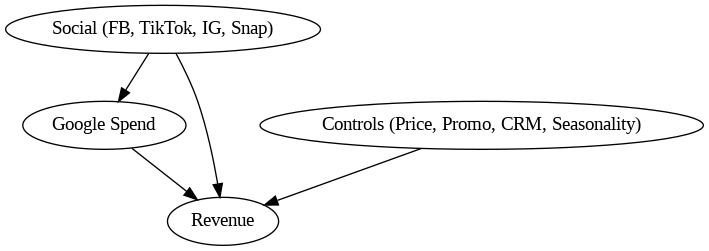

# Marketing Mix Modeling (MMM) with Mediation

This repository implements a **Marketing Mix Modeling (MMM)** pipeline to explain **Revenue** as a function of marketing spend, price, promotions, and CRM activity.  

We explicitly treat **Google spend as a mediator** between Social channels (Facebook, TikTok, Instagram, Snapchat) and Revenue.  
The project is designed to be **causally aware, reproducible, and product-oriented**.

---

## Objectives
- Quantify the impact of media and control variables on Revenue.  
- Capture **carryover (Adstock)** and **diminishing returns (Saturation)**.  
- Respect causal structure: **Social → Google → Revenue** (mediated effect).  
- Validate using **time-series cross-validation** (no look-ahead).  
- Provide **diagnostics, sensitivity tests, ROAS estimates, and stability checks**.  
- Deliver **practical recommendations** for marketing/growth teams.  

---

## Causal Framing

We assume that part of Social’s effect on Revenue is **mediated by Google spend** (social ads trigger search intent → higher Google spend → revenue). At the same time, Social may have a **direct effect** on Revenue.  

Controls (Price, Promotions, Emails, SMS, Seasonality, Trend) adjust for confounding.

### DAG



- **Social → Google → Revenue** = *Indirect (mediated) effect*  
- **Social → Revenue** = *Direct effect*  
- **Controls → Revenue** = adjustment for confounding  
- We use **residualized Google** to avoid leakage.  

---

## 📊 Modeling Approach

### 1. Data Preparation
- Handle missing/zero spends with forward fill → 0.  
- Apply **Adstock** (θ=0.6, lags=8).  
- Apply **Saturation** (Hill transform, half-sat = 70th percentile).  
- Add **Trend & Seasonality** (time index, sin/cos terms).  

### 2. Stage 1 – Mediator Model
- `Google Spend ~ Social Channels`  
- Extract:
  - `google_pred` (predicted Google from social)  
  - `google_resid` (residual, non-social Google component)  

### 3. Stage 2 – Revenue Model
- `Revenue ~ Social_sat + google_resid + Controls`  
- **ElasticNet** (main interpretable model).  
- **Random Forest** (non-linear benchmark).  
- **Validation:** TimeSeriesSplit (5 folds).  

### 4. Diagnostics
- Predicted vs Actual plots  
- Residuals over time  
- Rolling stability checks  

### 5. Mediation Effects
- Decompose **direct vs indirect** effects for each social channel.  

### 6. Sensitivity Analysis
- Price elasticity: ±10%  
- Promotions ON vs OFF  

### 7. ROAS
- Marginal ROAS from +5% spend scenarios.  

---


# PROJECT FOLDER
``` 
MMM-Project/
├── README.md
├── REPORT.md
├── requirements.txt
├── MMM_end_to_end.ipynb
├── data/
│   └── weekly_data.csv
├── artifacts/
│   └── figures/
└── (any other files)
```
## ▶️ How to Run

### Option 1 — Google Colab
1. Mount Google Drive:
   ```python
   from google.colab import drive
   drive.mount('/content/drive')
    ```
2.Copy repo into Drive.

3.Open MMM_end_to_end.ipynb.

4.Run all cells → outputs saved to /artifacts/.
