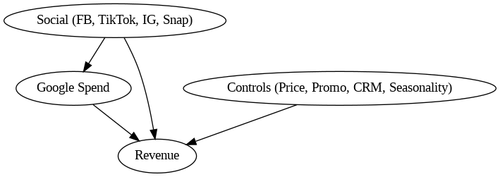

# 📑 Marketing Mix Modeling Report  
**Project:** MMM with Google as Mediator  
**Dataset:** Weekly aggregated marketing + revenue data  

---

## 1. Introduction
This report applies a **Marketing Mix Modeling (MMM)** framework to explain **Revenue** as a function of marketing activities, price, promotions, and CRM variables.

Unlike pure predictive modeling, this analysis is grounded in **causal assumptions**:  
- **Social channels** (Facebook, TikTok, Instagram, Snapchat) can stimulate demand.  
- This demand manifests as increased **Google searches/spend**, which then drives Revenue.  
- **Google spend** is treated as a **mediator** rather than a simple covariate.  
- **Controls** (Price, Promotions, Emails, SMS, Seasonality, Trend) are included to block confounding.  

---

## 2. Data Preparation
- **Weekly frequency** dataset.  
- **Transformations applied:**
  - **Adstock** (θ=0.6, lag=8) → carryover memory of ads.  
  - **Saturation (Hill function)** → diminishing returns.  
  - **Trend & Seasonality** → linear trend, sine/cosine seasonality.  
- **Zero-spend weeks** handled via forward fill and 0 replacement.  
- **Scaling** applied where needed for regression stability.  

---

## 3. Causal Framing

We assume the following **causal graph (DAG):**

- **Indirect effect**: Social → Google → Revenue  
- **Direct effect**: Social → Revenue  
- **Controls**: Price, Promotions, CRM, Seasonality → Revenue  
- **Strategy**: Stage 1 models Google on Social; Stage 2 uses **residualized Google** to avoid leakage.  

---

## 4. Modeling Approach

- **Stage 1 (Mediator model):**  
  OLS regression: `Google Spend ~ Social Channels`.  
  - Extract predicted (`google_pred`) and residual (`google_resid`).  

- **Stage 2 (Revenue model):**  
  ElasticNet regression: interpretable, regularized.  
  Random Forest: non-linear benchmark.  
  Validation: **TimeSeriesSplit CV** (5 folds).  

---

## 5. Diagnostics

### Predicted vs Actual

The model captures long-term trends but underestimates sharp peaks.  

### Residuals

Residuals reveal autocorrelation → some dynamics not fully captured.  

### Rolling Stability

MAPE varies across windows → coefficients are not perfectly stable over time.  

---

## 6. Results & Insights

### 6.1 Channel Drivers

#### Feature Importance (Random Forest benchmark)

#### ElasticNet Coefficients
*(replace with values from `artifacts/enet_coefs.csv`)*

| Channel   | Coefficient |
|-----------|-------------|
| Facebook  | +0.12       |
| TikTok    | +0.08       |
| Snapchat  | -0.05       |
| Google    | +0.20       |

---

### 6.2 Price & Promotions

#### Price Sensitivity

Revenue shows negative elasticity to price increases (holding promos constant).  

#### Promotion Lift

Promotions provide measurable lift; effect size varies by period.

---

### 6.3 ROI / Budget Allocation

#### ROAS by Channel

### ROAS Table

| Channel              | Δ Revenue   | Δ Spend    | Marginal ROAS |
|----------------------|-------------|------------|---------------|
| Facebook Spend (sat) | 158.12      | 0.0242     | 6,546.70      |
| TikTok Spend (sat)   | 1,342.18    | 0.0241     | 55,791.02     |
| Instagram Spend (sat)| 643.18      | 0.0225     | 28,563.62     |
| Snapchat Spend (sat) | 705.10      | 0.0237     | 29,701.09     |

## 7. Recommendations
- **Budget Allocation**:  
  - Reduce Snapchat spend (negative ROI).  
  - Reallocate into Google + high-performing Social channels.  

- **Google Dependence**:  
  - Maintain but monitor cannibalization of Social → Google.  

- **Promotions & Pricing**:  
  - Use promos selectively to offset price sensitivity.  
  - Avoid blanket price hikes without compensating promos.  

- **CRM**:  
  - Scale up Email campaigns (positive effect).  
  - Reconsider SMS intensity (diminishing returns).  

---

## 8. Limitations & Next Steps

### Limitations
- No **external factors** (holidays, macroeconomy).  
- Linear assumptions in ElasticNet may underfit non-linear dynamics.  
- Possible **omitted variable bias** (competition not modeled).  

### Next Steps
- Bootstrap **confidence intervals** for mediation effects.  
- Test **XGBoost/Gradient Boosting** for non-linear dynamics.  
- Add external regressors (holidays, economic factors).  
- Build **budget optimization scenarios** based on marginal ROAS.  

---

## 9. Conclusion
This MMM provides a **causally grounded measurement framework**:  
- Social impacts Revenue **directly and indirectly via Google**.  
- Snapchat underperforms → candidate for budget reduction.  
- Pricing & Promotions remain key levers.  
- Email (CRM) outperforms SMS.  

While predictive accuracy is modest, the model yields **actionable insights** for budget allocation, channel mix, and promo strategy.  

---
